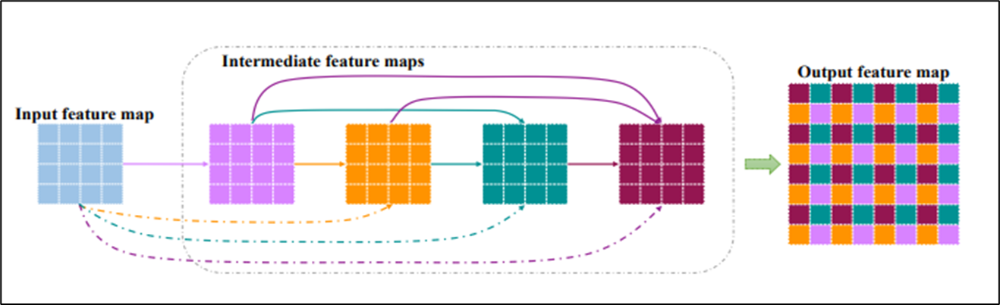
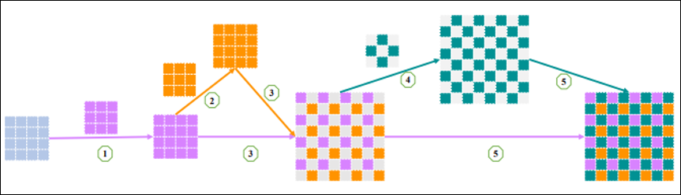
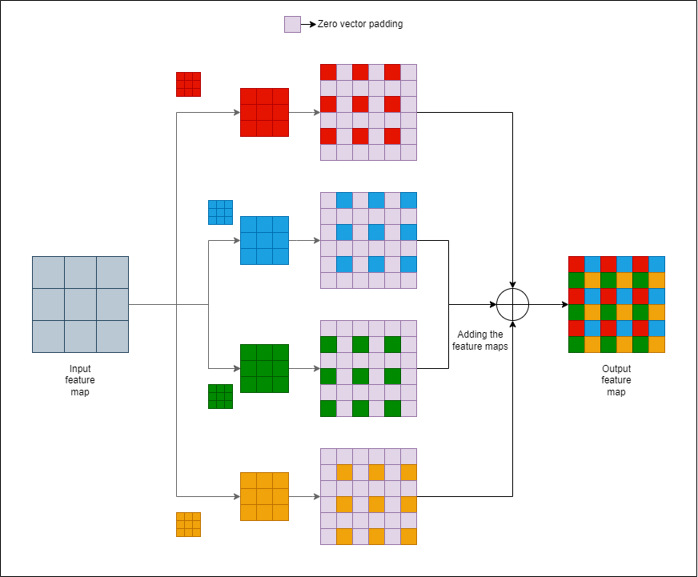

# Modified-pixel-transposed-convolution

This repository implements neural networks based on pixel-transposed convolution (PixelTCL) and its variations as discussed in Reference item 1, using Tensorflow. The code is replicated into a ipynb file so that it can be run on Colab and Kaggle in case there's a need for extra GPU runtime.

# Introduction

Transposed convolution is a process which up-samples the input using the process of convolution by an integer factor.
This process is occasionally referred to as deconvolution, which becomes a source of confusion since it also refers to the operation which is the mathematical inverse of convolution. To avoid this, we will use the term transposed convolution to describe the process. This process is used to reverse the effects of convolution in a convolutional neural network.

## Datasets

1. Oxford-IIIT Pet
The code in this repository uses the [Oxford-IIIT Pet Dataset](https://www.robots.ox.ac.uk/~vgg/data/pets/) ([Parkhi et al, 2012](https://www.robots.ox.ac.uk/~vgg/publications/2012/parkhi12a/parkhi12a.pdf)) for training and validating models used to demonstrate the operation of the TCL layers. This dataset consists of images of 37 pet breeds, with 200 images per breed (~100 each in the training and test splits). Each image includes the corresponding labels, and pixel-wise masks. The masks are class-labels for each pixel. Each pixel is given one of three categories:

* Class 1: Pixel belonging to the pet.
* Class 2: Pixel bordering the pet.
* Class 3: None of the above/a surrounding pixel.

2. Pascal VOC2012 dataset
The network can also be trained on the [Pascal VOC2012 dataset](http://host.robots.ox.ac.uk/pascal/VOC/voc2012/). 

This dataset has 21 classes (including the background), and in addition to that there is a border class marked in the original version of the dataset. The border pixels are removed in [this version](https://www.kaggle.com/datasets/swagatpanda23/voc2012mod/versions/6), and therefore it contains exactly 21 classes. Some points to note when training a model with this dataset.
* This is a hard dataset to train compared to the Oxford-IIIT pets dataset because:
    * the number of classes is larger
    * multiple classes often appear in the same image, at a varying frequency
    * 75% of the pixels are background pixels, i.e., the dataset is unbalanced.
* It requires more training time compared to the Oxford-IIIT pets dataset due to a much larger number of images (~3000 in the former to ~10,500 in the latter)

Any other datasets that are to be used can be configured by modifying the config.py file. The datasets can be loaded using either tfds datasets, or as directories within the project. The structure for the latter is specified in the extras section of this file. The directory must contain the following three directories for the code to work:
* DatasetInfo: Contains .txt files that specify which files in JPEGImages are to be used for training and validation.
* JPEGImages: Contains the images that are to be used for training and validating the model.
* SegmentationClass: Contains the labels that are to be used for training and validating the model.
More details regarding directory structure for the project is contained in directory_struct.txt and the [Project Setup section](#project-setup).

## Pixel and iPixel TCL

The concept of pixel and ipixel TCL was first introduced in [Pixel Deconvolutional Networks, Gao et al.](https://arxiv.org/abs/1705.06820). This method of transposed convolution aims at reducing checkerboard artefacts in the predicted feature maps, by introducing direct connections to the input feature map, which helps it retain some of the information about the neighbouring pixels. iPixel TCN uses concatenation of the outputs of each of the successive convolution with the input feature map before they padded with zero rows and columns and added together, whereas Pixel TCN doesn't include the input feature map in each of the aforementioned concatenations. The following schematics depict the process discussed in this paragraph:

The concept in one schematic. Each step in this process represents a convolution followed by a concatenation with the previous feature maps.


The implementation used by Gao et al.


## The modified iPixelDCN 

The modified iPixelDCN uses the same input feature maps to generate (upsample factor)$^2$ secondary feature maps, which are then padded with zero rows and columns and added together to generate the final feature map. 
The modified iPixel TCL uses the same input map to generate k $^2$ maps through convolution, and then combines them to generate the final up-sampled map (k is the scaling factor). This method can be used for any integer scaling factor, unlike PixelTCL. 
The feature maps can be generated independently (using parallel operations), which means that the entire operation can be done in constant time if parallel execution is employed. However, the zero padding operations increase as (k-1)$^2$, which does consumes some considerable amount of time even with parallel execution. The number of operations are still less than PixelTCL for the same level of upscaling. This scheme of parallel execution of a for loop has not been explored in this project (maybe in a future update). 

This process is depicted in the following schematic:


# Results

The following results were obtained with 10 epochs of training, due to limited hardware resources. The results demonstrate the improvements in the performance on difficult examples. These examples are from the validation dataset. The model wasn't exposed to these images during training.

Model 0: Dense U-Net with ASPP + built-in Transposed Convolution

Performance on the validation data:


Training and validation performance trends:


Model 1: Dense U-Net with ASPP + Pixel TCN

Performance on the validation data:


Training and validation performance trends:


Model 2: Dense U-Net with ASPP + iPixel TCN

Performance on the validation data:


Training and validation performance trends:


Model 3: Dense U-Net with ASPP + modified iPixel TCN

Performance on the validation data:


Training and validation performance trends:


Deeplab Xception was used as a reference model to check for the performance of the Dense UNet because it was the model that performed the best on the Pascal VOC2012 dataset. Due to the hardware limitations and reasons described in [Datasets](#datasets) the models in this project were eventually trained on Oxford-IIIT pets dataset.

## Link to the model files

Google drive link for model files: [Model files](https://drive.google.com/drive/folders/1PKkKiBrOTzsM818nMtHkd3pC2ScwmOqy?usp=sharing)

# Project Setup
The models are saved as model_modelNumber. Refer to the directory structure or directory_struct.txt for more information.

**Training**

Command line arguments:

*-m : model number*

*-e : number of epochs for training.*

```
python main_train.py -m 0 -e 1
```
**Validation**

Command line arguments:

*-m : model number*
```
python main_train.py -m
```
**Test**

Command line arguments:

*-m : model number*

```
python main_train.py -m
```

The directory structure for this project should be as follows (directory_struct.txt):
```
C:.
├───analogous_ipynb_notebook
├───dataset_1
│   ├───DatasetInfo
│   ├───JPEGImages
│   └───SegmentationClass
├───dataset_2
│   ├───DatasetInfo
│   ├───JPEGImages
│   ├───SegmentationClass
│   └───SegmentationClassFinalAug
├───model_and_training
│	model_instances.py
│	model_utilfuncs.py
│       	train.py
├───model_details
│   ├───model_schematics
│   └───saved_model
│       ├───model_0
│       │   └───saved_complete_model
│       ├───model_1
│       │   └───saved_complete_model
│       ├───model_2
│       │   └───saved_complete_model
│       ├───model_3
│       │   └───saved_complete_model
│       └───model_4
│             └───saved_complete_model
├───results
│   ├───test_sample_results
│   │   ├───model_0
│   │   ├───model_1
│   │   ├───model_2
│   │   ├───model_3
│   │   └───model_4
│   ├───training_plots
│   │   ├───model_0
│   │   ├───model_1
│   │   ├───model_2
│   │   ├───model_3
│   │   └───model_4
│   ├───training_sample_results
│   │   ├───model_0
│   │   ├───model_1
│   │   ├───model_2
│   │   ├───model_3
│   │   └───model_4
│   └───validation_sample_results
│       ├───model_0
│       ├───model_1
│       ├───model_2
│       ├───model_3
│       └───model_4
├───tensorboard
│   ├───model_0
│   ├───model_1
│   ├───model_2
│   ├───model_3
│   └───model_4
├───test_data
└───utils
       	display_utils.py
       	image_proc_utils.py
       	instantiation_class.py
       	load_and_split_dataset.py
```

# References:
1. [Hongyang Gao's GitHub repository](https://github.com/HongyangGao/PixelTCN) and [Paper discussing PixelTCN and iPixelTCN, Gao et al](https://arxiv.org/abs/1705.06820)
2. [Reference for Tensorflow metrics subclassing](https://github.com/tensorflow/tensorflow/blob/master/tensorflow/python/keras/metrics.py)
3. [Reference for Tensorflow losses subclassing](https://github.com/tensorflow/tensorflow/blob/master/tensorflow/python/keras/losses.py)
4. [Reference for Tensorflow callbacks](https://github.com/tensorflow/tensorflow/blob/master/tensorflow/python/keras/callbacks.py)
5. [Asymmetric Loss for Multi-Label Classification, Ben-Baruch et al](https://arxiv.org/pdf/2009.14119v4.pdf)
6. [Densely connected convolutional networks, Huang et al](https://arxiv.org/pdf/1608.06993.pdf)
7. [Encoder-Decoder with atrous spatial pyramidal pooling for semantic segmentation of Images, Chen et al](https://arxiv.org/pdf/1802.02611.pdf)
8. [The one hundred layered tiramisu, Jegou et al](https://arxiv.org/pdf/1611.09326.pdf)
9. [U-Nets: Convolutional neural networks for Image Segmentation, Ronneberger et al](https://arxiv.org/pdf/1505.04597.pdf)
10. [Deeplab Xception: Separable convolutions, Chollet](https://arxiv.org/pdf/1610.02357.pdf)
